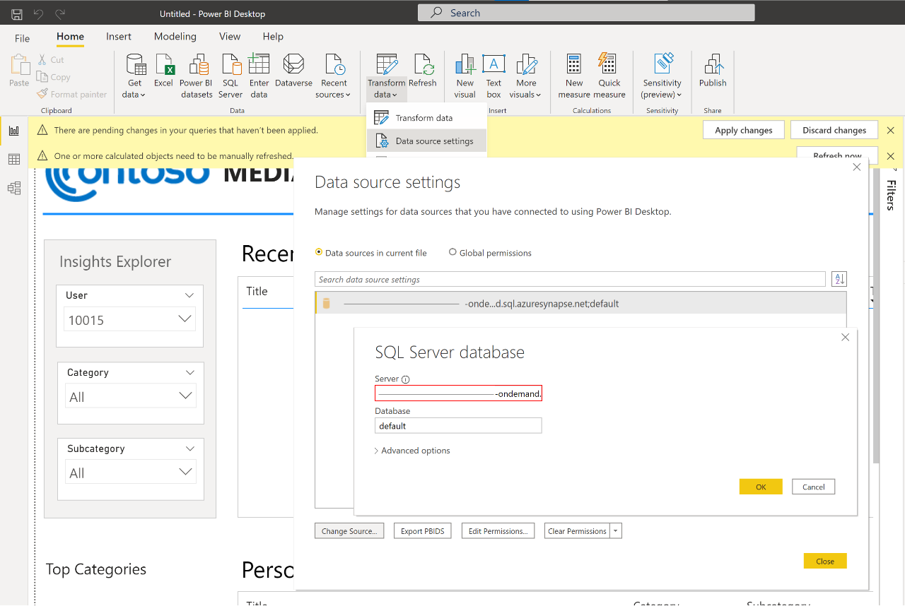
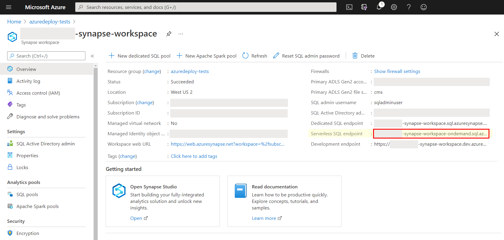

# Deployment Guide

## Step 1. Download Files
To start, clone or download this repository and navigate to the project's root directory.

We are using the open source [MIND: Microsoft News Dataset](https://msnews.github.io/). After agreeing to the terms, links are available to download and unzip the following files. Please note you only need the large test data along with the two small datasets:
- Training Set (`MINDsmall_train.zip`)
- Validation Set (`MINDsmall_dev.zip`)
- Test Set (`MINDlarge_test.zip`)

Visit https://msnews.github.io/ to download the files above.

## Step 2. Setup Resources
Start by deploying Azure Synapse and its related resources:

- This button links to the [Azure custom deployment](https://ms.portal.azure.com/#create/Microsoft.Template) page where you can use the [azuredeploy.json](https://raw.githubusercontent.com/microsoft/Azure-Synapse-Content-Recommendations-Solution-Accelerator/main/azuredeploy.json) as your Azure Resource Manager (ARM) template.
- If you prefer to setup manually, you need to deploy Azure Synapse Analytics with a Spark pool setup in the workspace and access to Azure Data Lake (Gen2) Storage Account.

## Step 3. Upload Sample Dataset
In this step you will upload the [MIND: Microsoft News Dataset](https://msnews.github.io/) datasets to the Azure Data Lake (Gen2) Storage.

File upload is available by downloading the [Azure Storage Explorer](https://azure.microsoft.com/en-us/features/storage-explorer/) application or using [azcopy](https://docs.microsoft.com/en-us/azure/storage/common/storage-ref-azcopy).
1. Open the Microsoft Azure Storage Explorer application
2. Connect to your Azure account
3. In the Explorer, expand your subscription and find the storage account deployed in Step 1
4. Expand "Blob containers" and click on the `cms` container
5. Create a new folder named `MicrosoftNewsDataset` and double-click into it
6. Drag & drop or click `Upload > Upload Folder...` for the following unzipped MIND folders:
    - `MINDsmall_train/` (Training Set)
    - `MINDsmall_dev/` (Validation Set)
    - `MINDlarge_test/` (Test Set)

### Step 4. Security Access
### Step 4.1 Add your IP address to Synapse firewall
Before you can upload assests to the Synapse Workspace you will need to add your IP address:
1. Go to the Synapse resouce you created in the previous step. 
2. Navigate to `Firewalls` under `Security` on the left hand side of the page.
3. At the top of the screen click `+ Add client IP`
      
4. Your IP address should now be visable in the IP list (optionally, assign other users' IPs)

### Step 4.2: Update storage account permisions 
In order to perform the necessary actions in Synapse workspace, you will need to grant more access.
1. Go to the Azure Data Lake Storage Account created above
2. Go to the `Access Control (IAM) > + Add > Add role assignment` 
3. Now click the Role dropdown and select `Storage Blob Data Contributor`
    - Search for your Synapse workspace name (ie `recommend-synapse-workspace`)
    - Als add your username and any other usernames to the search bar
4. Click `Save` at the bottom
5. Repeat steps 2-4 to add the `Contributor` role to the Synapse workspace as well 

### Synapse Workspace as Contributor & SBDC for storage account
To enable other users to use this storage account after you create your workspace, perform these tasks:
- Assign other users to the Contributor role on workspace
- Assign other users the appropriate Synapse RBAC roles using Synapse Studio
- Assign yourself and other users to the Storage Blob Data Contributor role on the storage account

[Learn more](https://docs.microsoft.com/azure/synapse-analytics/security/how-to-set-up-access-control)

## Step 5. Upload Noteboks
1. Launch the Synapse workspace (via Azure portal > Synapse workspace > Workspace web URL) 
2. Go to `Develop`, click the `+`, and click `Import` to select all Spark notebooks from the repository's `/src/` folder
3. For each of the notebooks, select `Attach to > spark1` in the top dropdown
4. Update `account_name` variable to your ADLS in the [01-Load-Data.ipynb](./src/01-Load-Data.ipynb) notebook
5. Publish your new notebooks so they are saved in your workspace
6. Run the following notebooks in order:
    - [01-Load-Data.ipynb](./src/01-Load-Data.ipynb)
    - [02-Train-Model.ipynb](./src/02-Train-Model.ipynb)
    - [03-Recommendations.ipynb](./src/03-Recommendations.ipynb)

## Step 6. Explore Insights
Visualize the personalized recommendations using a Power BI dashboard:
1. Download [Power BI Desktop](https://www.microsoft.com/en-us/download/details.aspx?id=58494)
2. Open the [reports/ContentRecommendations.pbit](./reports/ContentRecommendations.pbit) file
3. Cancel the Refresh pop-up since the data source needs to be updated
4. Click `Transform data > Data source settings > Change Source...` from the top menu

      
5. Update the Server field with your `Serverless SQL endpoint` which can be found within `Azure > Synapse workspace > Overview`.

      
6. Keep database as `default` and click `OK`

# Congratulations
You have completed this solution accelerator and should now have a report to explore the personalized recommendations:

  

