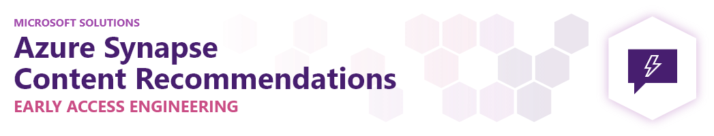
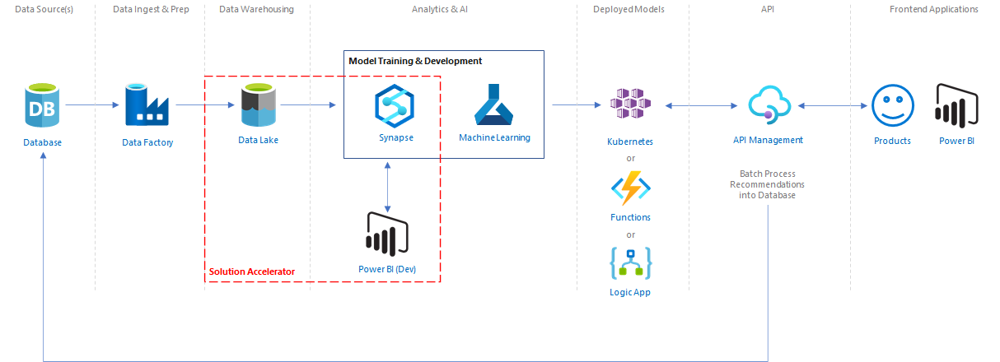
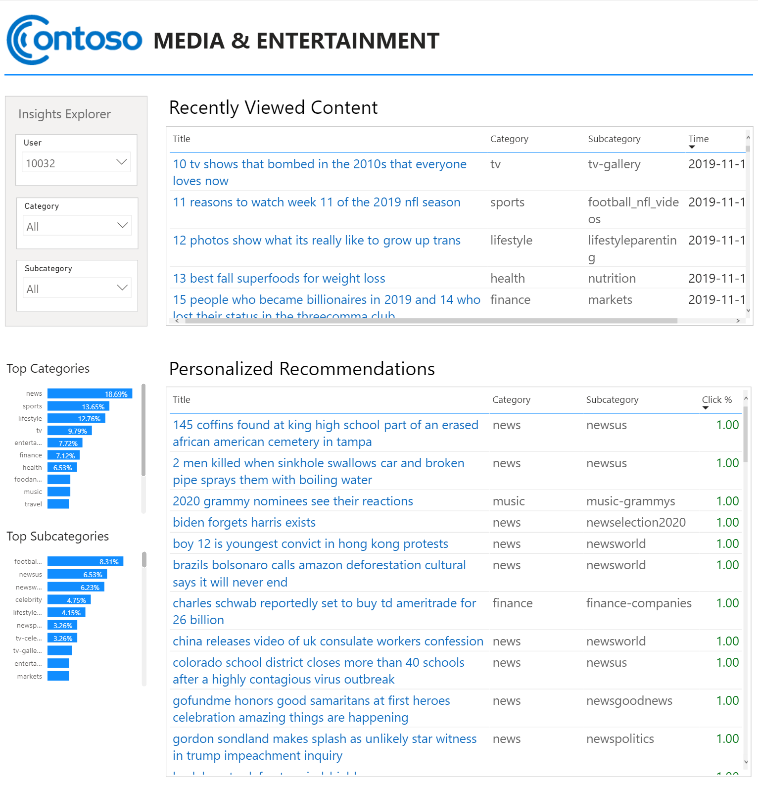

# Azure Synapse Content Recommendations Solution Accelerator
This accelerator provides a simplified solution for creating personalized content recommendations based on user activity. Companies across industries are publishing content and gathering user activity data. As content stakeholders, we need to maintain and increase our customer engagements. Personalized recommendations can help our audience alleviate information overload, discover new content, and improve their overall experience. Targeting customers with personalized content and advertising can help increase monetization opportunities within our product experiences.

## Prerequisites
To use this solution accelerator, you will need access to an [Azure subscription](https://azure.microsoft.com/free/). While not required, a prior understanding of data science, Azure, and Synapse will be helpful.

## Getting Started

1. Clone or download this repository and navigate to the project's root directory
2. Go to the [Deployment guide](./DEPLOY.md) for how to deploy this solution

## Key concepts
This solution accelerator focuses on the data insights that can be quickly achieved using a simple AI model and dataset. By analyzing content metadata and user activity, we can personalize recommendations based on each user's history and the similarity of other users' consumption patterns.

The AI model accepts a single user and multiple content items as input to produce a click probability score for each content item. A visualization tool is presented in Power BI to explore the personalized content recommendations for various users.

## Reference Architecture
This solution accelerator focuses the data science work needed to create personalized recommendations. We're leveraging a sample dataset that is pre-prepared and we're visualizing the insights using an admin view to explore various users. Please see the next steps section below for integrating your data sources, preparing the data, and deploying an API.

## Sample Report
We will explore insights and validate results of the personalized recommendations by leveraging a Power BI report:
  

## Next Level
Quickly get content recommendations for your users by leveraging Azure Synapse to [integrate with pipelines](https://docs.microsoft.com/en-us/azure/synapse-analytics/get-started-pipelines) for your data sources and prepare the data in a similar format to the sample dataset. Update the file path variables in the [Spark notebooks](./src/) and rerun to see updated results for your audience.

## Sample Dataset
The [MIND: MIcrosoft News Dataset](https://msnews.github.io) contains about 160k English news articles and more than 15 million impression logs generated by 1 million users. Every news article contains rich textual content including title, abstract, body, category and entities. Each impression log contains the click events, non-clicked events and historical news click behaviors of this user before this impression. To protect user privacy, each user was de-linked from the production system when securely hashed into an anonymized ID.

| File Name | Description
| :------------- | :-------------
| behaviors.tsv  | Click history and impression logs of users
| news.tsv  | Metadata about content items

### behaviors.tsv
| Column | Description | Data Sample
| :------------- | :------------- | :-------------
| Impression ID | ID of an impression | 91
| User ID | Anonymous ID of user | U397059
| Time | Impression time | 11/15/2019 10:22:32 AM
History | ID list of clicked items | N106403 N71977 N97080 N102132 N97212 N121652
| Impressions | List of items displayed in impression and user's click behaviors (1 for click and 0 for non-click) | N129416-0 N26703-1 N120089-1 N53018-0 N89764-0 N91737-0 N29160-0
 
### news.tsv
| Column | Data Sample
| :------------- | :-------------
| News ID | N37378
| Category | sports
| SubCategory | golf
| Title | PGA Tour winners
| Abstract | A gallery of recent winners on the PGA Tour.
| URL | https://www.msn.com/en-us/sports/golf/pga-tour-winners/ss-AAjnQjj?ocid=chopendata
| Title Entities | [{"Label": "PGA Tour", "Type": "O", "WikidataId": "Q910409", "Confidence": 1.0, "OccurrenceOffsets": [0], "SurfaceForms": ["PGA Tour"]}]	
| Abstract Entites | [{"Label": "PGA Tour", "Type": "O", "WikidataId": "Q910409", "Confidence": 1.0, "OccurrenceOffsets": [35], "SurfaceForms": ["PGA Tour"]}]

For more detailed information, see the [MIND dataset description](https://github.com/msnews/msnews.github.io/blob/master/assets/doc/introduction.md) and the [MIND paper (Wu et al., ACL 2020)](https://msnews.github.io/assets/doc/ACL2020_MIND.pdf)

## Further Reading
- See the [Microsoft Recommenders repo](https://github.com/microsoft/recommenders) for more advanced recommendation algorithms
- See the [Retail Recommender Solution Accelerator](https://github.com/microsoft/Azure-Synapse-Retail-Recommender-Solution-Accelerator/) for an example of integrating Azure Machine Learning and setting up an API

### Microsoft Learn
- [Realize Integrated Analytical Solutions with Azure Synapse Analytics](https://docs.microsoft.com/en-us/learn/paths/realize-integrated-analytical-solutions-with-azure-synapse-analytics/)
- [Data integration at scale with Azure Data Factory or Azure Synapse Pipeline](https://docs.microsoft.com/learn/paths/data-integration-scale-azure-data-factory/)
- [Perform data engineering with Azure Synapse Apache Spark Pools](https://docs.microsoft.com/en-us/learn/paths/perform-data-engineering-with-azure-synapse-apache-spark-pools/)
- [Build data analytics solutions using Azure Synapse serverless SQL pools](https://docs.microsoft.com/en-us/learn/paths/build-data-analytics-solutions-using-azure-synapse-serverless-sql-pools/)
- [Work with Hybrid Transactional and Analytical Processing Solutions using Azure Synapse Analytics](https://docs.microsoft.com/en-us/learn/paths/work-with-hybrid-transactional-analytical-processing-solutions/)

### More Documentation
- [Built-in Synapse RBAC roles and scopes](https://docs.microsoft.com/en-us/azure/synapse-analytics/security/synapse-workspace-synapse-rbac-roles#built-in-synapse-rbac-roles-and-scopes)
- [Understand the roles required to perform common tasks in Synapse](https://docs.microsoft.com/en-us/azure/synapse-analytics/security/synapse-workspace-understand-what-role-you-need#:~:text=Tasks%20and%20required%20roles%20%20%20%20Task,%20%20none%20%2021%20more%20rows)

For additional training and support, please see:
- [Azure Synapse Analytics](https://azure.microsoft.com/en-us/services/synapse-analytics/)
- [Power BI](https://docs.microsoft.com/en-us/power-bi/)
- [Azure Machine Learning Services](https://azure.microsoft.com/en-us/services/machine-learning/)

## Contributing
This project welcomes contributions and suggestions.  Most contributions require you to agree to a Contributor License Agreement (CLA) declaring that you have the right to, and actually do, grant us the rights to use your contribution. For details, visit https://cla.opensource.microsoft.com.

When you submit a pull request, a CLA bot will automatically determine whether you need to provide a CLA and decorate the PR appropriately (e.g., status check, comment). Simply follow the instructions provided by the bot. You will only need to do this once across all repos using our CLA.

This project has adopted the [Microsoft Open Source Code of Conduct](https://opensource.microsoft.com/codeofconduct/). For more information see the [Code of Conduct FAQ](https://opensource.microsoft.com/codeofconduct/faq/) or contact [opencode@microsoft.com](mailto:opencode@microsoft.com) with any additional questions or comments.

## Trademarks
This project may contain trademarks or logos for projects, products, or services. Authorized use of Microsoft trademarks or logos is subject to and must follow [Microsoft's Trademark & Brand Guidelines](https://www.microsoft.com/en-us/legal/intellectualproperty/trademarks/usage/general). Use of Microsoft trademarks or logos in modified versions of this project must not cause confusion or imply Microsoft sponsorship. Any use of third-party trademarks or logos are subject to those third-party's policies.

## Data Collection
The software may collect information about you and your use of the software and send it to Microsoft. Microsoft may use this information to provide services and improve our products and services. You may turn off the telemetry as described in the repository. There are also some features in the software that may enable you and Microsoft to collect data from users of your applications. If you use these features, you must comply with applicable law, including providing appropriate notices to users of your applications together with a copy of Microsoft's privacy statement. Our privacy statement is located at https://go.microsoft.com/fwlink/?LinkID=824704. You can learn more about data collection and use in the help documentation and our privacy statement. Your use of the software operates as your consent to these practices.
